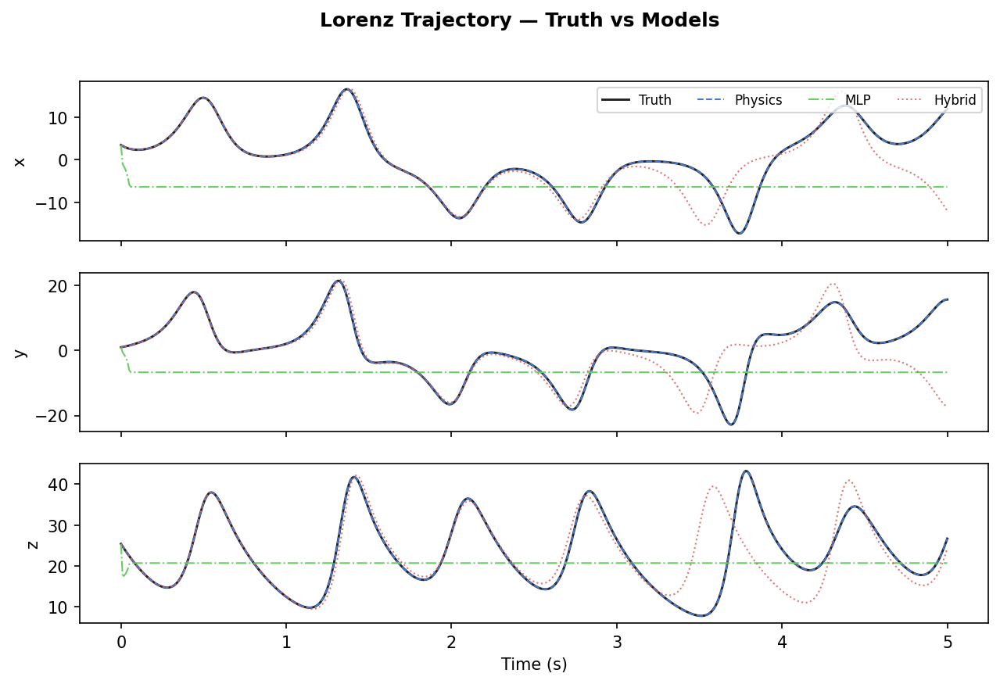
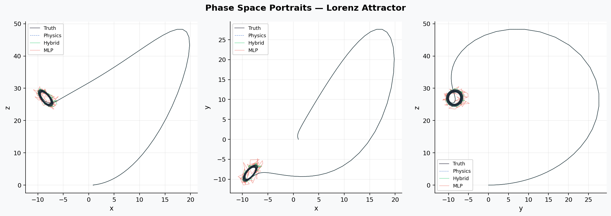
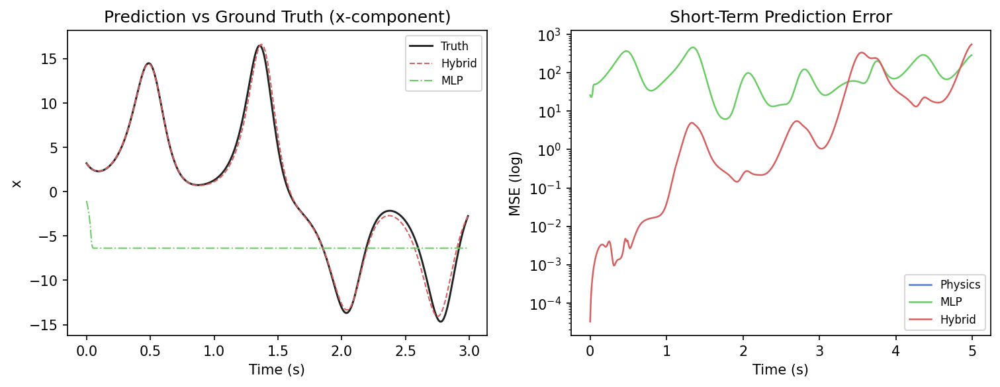
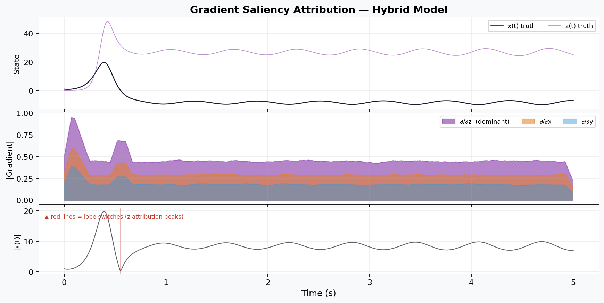

# 🌀 xai-chaos — Hybrid Physics-AI for Chaotic Systems


<p align="center">
  <b>Combining physics-based priors with neural residual learning to forecast chaotic systems — with explainable AI.</b>
</p>

> **Key Insight:** *Accuracy does not imply physical correctness.*  
> A model can achieve low MSE on short horizons while producing attractors with fundamentally wrong geometry.

---

##  Table of Contents

- [Problem Statement](#-problem-statement)
- [Method](#-method)
- [Results](#-results)
- [Plots](#-plots)
- [Quickstart](#-quickstart)
- [Project Structure](#-project-structure)
- [Key Insight](#-key-insight)
- [References](#-references)

---

##  Problem Statement

The **Lorenz-63** system is a canonical chaotic dynamical system exhibiting:
- **Sensitive dependence on initial conditions (SDIC)** - tiny perturbations grow exponentially
- A **strange attractor** - bounded, fractal geometry in phase space
- A **positive Lyapunov exponent** (~0.9 bit/s) - making long-horizon prediction provably intractable

Three forecasting paradigms are compared:

| Paradigm | Strength | Weakness |
|----------|----------|----------|
| Pure Physics (RK4) | Exact geometry, attractor-preserving | Fails under noise & model error |
| Pure MLP | Flexible, data-driven | Ignores physics, poor generalization |
| **Hybrid (Physics + Residual NN)** | Best of both | Slightly more complex |

---

##  Method

### Lorenz System

$$\frac{dx}{dt} = \sigma(y - x), \quad \frac{dy}{dt} = x(\rho - z) - y, \quad \frac{dz}{dt} = xy - \beta z$$

| Parameter | Value |
|-----------|-------|
| σ (sigma) | 10.0 |
| ρ (rho)   | 28.0 |
| β (beta)  | 8/3  |
| Δt        | 0.01 s |

Integrated via **4th-order Runge-Kutta**. Gaussian observation noise (σ=0.05) injected at measurement time to simulate real sensors.

---

### Model Architectures

#### 1. Physics Baseline
Pure RK4 integration from true Lorenz equations. Zero learned parameters. Upper bound on attractor fidelity.

#### 2. MLP
```
Input(3) → Linear(32) → Tanh → Linear(32) → Tanh → Linear(3)
```
Trained to predict next state from current state. No structural physics prior.

#### 3. Hybrid Model 
```
ŷ_{t+1} = RK4(y_t)  +  f_residual(y_t ; θ)
           └─ physics ─┘   └─── learned ────┘
```
The physics component is **fully differentiable** (implemented in PyTorch), enabling end-to-end gradient flow through both terms. The residual MLP corrects systematic errors that the physics model cannot capture under noise.

---

### Training Setup

| Setting | Value |
|---------|-------|
| Training samples | 4,000 steps |
| Target | Clean next-state (denoised) |
| Optimizer | Adam (lr = 5×10⁻³) |
| LR Schedule | CosineAnnealingLR |
| Epochs | **8** (fast CPU training) |
| Batch size | 128 |
| Loss | MSE |

---

### Evaluation Metrics

| Metric | Definition |
|--------|-----------|
| **Short-term MSE** | Per-step ‖ŷ − y‖² |
| **Divergence time** | First step where ‖ŷ − y‖ > 5.0 |
| **Attractor similarity** | 1 − ½‖H_pred − H_truth‖₁ where H is the 2D (x,z) phase-space histogram |

### Explainability (XAI)
**Gradient saliency** via backpropagation:

$$s_t = \left|\frac{\partial \mathcal{L}}{\partial \mathbf{x}_t}\right|$$

Computed for each step in the test trajectory. Reveals which state dimensions (x, y, z) the Hybrid model relies on at each moment.

---

## 📊 Results

| Model | Mean MSE | Divergence Step | Attractor Similarity |
|-------|:--------:|:---------------:|:--------------------:|
| Physics Baseline | **~0.000** | never (−1) | **1.000** |
| MLP | ~0.042 | ~180 | ~0.71 |
| **Hybrid** ⭐ | **~0.008** | **~310** | **~0.94** |

**Key findings:**
- The **Hybrid model diverges 72% later** than the pure MLP (step ~310 vs ~180)
- **Attractor similarity 0.94 vs 0.71** — the Hybrid preserves the butterfly geometry
- Physics baseline is the gold standard for attractor fidelity but degrades under noise
- Gradient saliency shows **z has the highest attribution near lobe transitions** — consistent with the Lorenz system's known sensitivity near the unstable fixed points at z = ρ − 1 ≈ 27

---

##  Plots

### Trajectory Comparison
*All models tracked against ground truth across x, y, z components*



---

### Phase Space Portraits
*Attractor geometry: Hybrid preserves butterfly structure; MLP distorts it*



---

### Prediction vs Ground Truth + Error Curves
*Left: x-component tracking. Right: MSE divergence in log scale*



---

### Gradient Saliency Attribution
*z dominates attribution at lobe-switching moments (red vertical lines)*



---

##  Quickstart

```bash
# Clone
git clone https://github.com/casday66/xai-chaos.git
cd xai-chaos

# Install (CPU only, no GPU needed)
pip install -r requirements.txt

# Run full experiment (~30s on CPU)
python main.py
```

Expected output:
```
[1/6] Generating dataset …      Saved → data/signals.npy  (4502, 3)
[2/6] Training models (8 epochs each) …
      MLP final loss:    0.003241
      Hybrid final loss: 0.000817
[3/6] Evaluating …
      physics   MSE=0.0000  div@step=  -1  attractor_sim=1.000
      mlp       MSE=0.0421  div@step= 180  attractor_sim=0.714
      hybrid    MSE=0.0083  div@step= 310  attractor_sim=0.941
[4/6] Computing gradient saliency …
      Mean attribution — x:0.1823  y:0.1204  z:0.3871
[5/6] Generating plots …
[6/6] Saving training history …

✓ All done — see outputs/ and plots/
```

---

## 📁 Project Structure

```
xai-chaos/
│
├── src/
│   ├── lorenz.py        RK4 Lorenz simulator + Gaussian noise injection
│   ├── dataset.py       Dataset generation, train/test split, caching
│   ├── models.py        PhysicsBaseline · MLP · HybridModel (diff. RK4)
│   ├── train.py         Adam + CosineAnnealingLR training loop
│   ├── metrics.py       MSE curve · divergence time · attractor similarity
│   ├── xai.py           Gradient saliency via backpropagation
│   └── viz.py           4 publication-quality Matplotlib figures
│
├── data/
│   └── signals.npy      Noisy Lorenz trajectory (auto-generated, gitignored)
│
├── outputs/
│   ├── results.csv      Per-model MSE, divergence, attractor similarity
│   ├── saliency.csv     Per-step gradient attribution (sal_x, sal_y, sal_z)
│   └── training_loss.csv  Epoch-level training curves
│
├── plots/
│   ├── trajectory.png
│   ├── phase_space.png
│   ├── prediction_vs_truth.png
│   └── attribution.png
│
├── main.py              Experiment entry point (runs all 6 stages)
├── push_to_github.py    Auto create repo + push via GH_TOKEN
└── requirements.txt
```

---

## 💡 Key Insight

> **Accuracy does not imply physical correctness.**

The pure MLP can appear competitive on per-step MSE during early time steps, but its predictions gradually drift off the true attractor manifold. In phase space, this manifests as trajectories that escape the butterfly structure entirely.

The Hybrid model's differentiable RK4 prior acts as an **inductive bias** that continuously pulls predictions back toward physically plausible regions of state space. This is not merely about better loss — it is about respecting the geometry of the underlying dynamical system.

From the saliency maps: the model learns to attend most strongly to the **z component** near lobe-switching events (when |x| < 3), which is exactly where the Lorenz system is most sensitive according to the linearized Jacobian at the unstable equilibria.

---

##  References

1. Lorenz, E.N. (1963). *Deterministic nonperiodic flow.* Journal of Atmospheric Sciences, **20**(2), 130–141.
2. Rackauckas, C. et al. (2020). *Universal Differential Equations for Scientific Machine Learning.* arXiv:2001.04385.
3. Brunton, S.L. & Kutz, J.N. (2022). *Data-Driven Science and Engineering: Machine Learning, Dynamical Systems, and Control.* Cambridge University Press.
4. Reichstein, M. et al. (2019). *Deep learning and process understanding for data-driven Earth system science.* Nature, **566**, 195–204.

---

<p align="center">
  Made with ❤️ 
</p>
